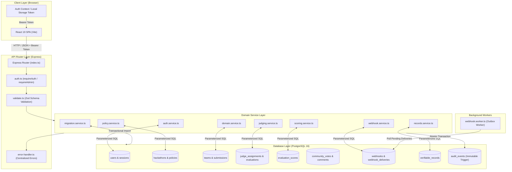
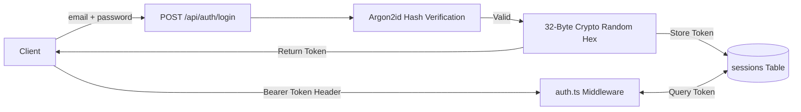
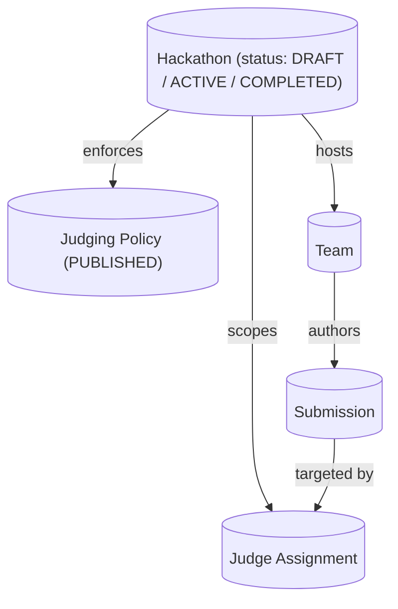
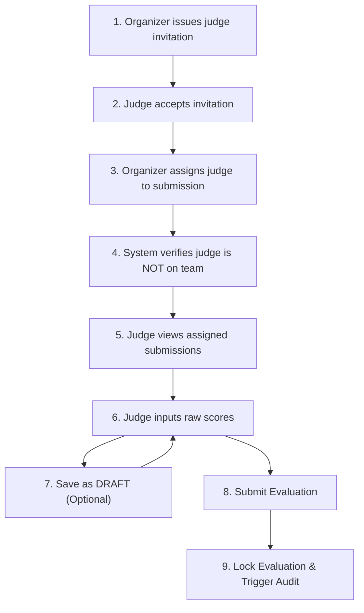
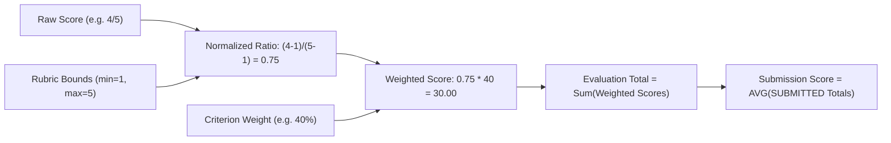

# System Architecture

## 1. System Overview

DOGFOOD 2026 is an API-first, self-hosted hackathon submission, judging, and verification platform. It enforces **server-side authority**, **deterministic scoring**, **relational data consistency**, and **cryptographic auditability**.

The system is decomposed into three principal tiers:
1. **Frontend Client Layer**: Single-Page Application (SPA) built with React 19, TypeScript, Vite, and Tailwind CSS. It operates strictly as an unprivileged REST API client.
2. **Backend Application Layer**: Node.js 20 / TypeScript application running Express. It encapsulates domain logic, credential verification (Argon2id), role authorization, min-max score normalization, Ed25519 cryptographic record signing, and outbox webhook delivery polling.
3. **Relational Persistence Layer**: PostgreSQL 16 database executing parameterized SQL directly through Node.js connection pools (`pg` library), enforcing constraints, unique indexes, foreign-key cascades, and audit immutability triggers without an ORM.

---

## 2. Architecture Diagram



---

## 3. Component Responsibilities

### Express REST API (`backend/src/routes/`)
- Handles HTTP request parsing, JSON schema validation using Zod (`validate.ts`), and route dispatching.
- Returns standardized JSON error responses with appropriate HTTP status codes (400, 401, 403, 404, 409, 422, 500).

### Authentication & Authorization Middleware (`backend/src/middleware/auth.ts`)
- `requireAuth`: Extracts `Authorization: Bearer <token>` header, queries the `sessions` table, and attaches `req.user` if valid.
- `requireAdmin`: Asserts `req.user.is_admin === true` for organizer-only operations.

### Domain & Scoring Services (`backend/src/services/`)
- `auth.service.ts`: Hashes passwords using Argon2id, generates 32-byte crypto-random hex session tokens.
- `domain.service.ts`: Manages team formation, project submissions, community voting, and comment creation.
- `judging.service.ts`: Manages judge invitations, judge assignment scoping, and evaluation lifecycle (`DRAFT` → `SUBMITTED`).
- `scoring.service.ts`: Performs min-max normalization `(raw - min)/(max - min)` and percentage weighting per rubric criterion in `saveEvaluation`.
- `records.service.ts`: Signs final completed hackathon results (`PARTICIPANT_CERTIFICATE` and `JUDGE_PARTICIPATION`) using Ed25519 keys (`signPayload`).
- `migration.service.ts`: Serializes and deserializes complete event states into portable JSON packages with transactional rollback.

### Background Webhook Worker (`backend/src/workers/webhook.worker.ts`)
- Asynchronous polling loop that queries `webhook_deliveries` for `PENDING` events where `next_retry_at <= NOW()`.
- Dispatches HTTP `POST` requests to registered receiver URLs with HMAC-SHA256 signature headers (`X-Dogfood-Signature`).
- Retries failed requests up to 5 attempts with exponential backoff (`Math.pow(5, attempt_count)` seconds).

---

## 4. Request Lifecycle

The detailed path of a scoring request:

```text
1. Client (Browser / React UI):
   User submits form in src/pages/JudgingSubmission.tsx.
   Axios sends PUT /api/judging/submissions/37c676c2-52b2-4474-ae90-25039d610169/evaluation
   Headers: Authorization: Bearer <token>, Content-Type: application/json
   Body: { "submit": true, "scores": [{ "criterion_id": "...", "raw_score": 4 }] }

2. Express Routing & Middleware:
   - index.ts receives request on port 8080 and passes to routes/judging.ts.
   - requireAuth executes: validates Bearer token against sessions table, attaches req.user.
   - validate.ts executes: Zod schema verifies presence of submit flag and scores array.

3. Role & Assignment Authorization:
   - judging.ts controller queries judge_assignments table:
     SELECT hackathon_id, hackathon_status, policy_id FROM judge_assignments a JOIN hackathons h ON a.hackathon_id = h.id WHERE a.submission_id = $1 AND a.judge_user_id = $2
   - If no match found, immediately throws AuthorizationError ("You are not assigned to this submission").

4. Evaluation State Check:
   - Queries evaluations table FOR UPDATE:
     SELECT id, status FROM evaluations WHERE submission_id = $1 AND judge_user_id = $2
   - If existing status is already "SUBMITTED", immediately throws ConflictError ("Evaluation has already been submitted and cannot be changed.").

5. Server-Side Score Normalization & Weighting:
   - scoring.service.ts saveEvaluation fetches rubric criteria from DB.
   - For each raw score:
     normalized_score = (raw_score - min_score) / (max_score - min_score)
     weighted_score = normalized_score * weight
   - Sums weighted_scores to compute total_score.

6. Atomic Database Transaction:
   - BEGIN transaction.
   - INSERT INTO evaluations (assignment_id, submission_id, judge_user_id, status, total_score) VALUES (...) ON CONFLICT DO UPDATE.
   - INSERT INTO evaluation_scores (evaluation_id, criterion_id, raw_score, normalized_score, weighted_score)...
   - INSERT INTO audit_events (hackathon_id, actor_user_id, action_type, payload) VALUES (...)
   - COMMIT transaction.

7. Response & UI Update:
   - Controller responds with HTTP 200 OK + payload { "data": { "id": "...", "status": "SUBMITTED", ... } }.
   - React UI receives response, displays success toast, updates status badge to "SUBMITTED", and locks input fields.
```

---

## 5. Authentication & Session Architecture



- **Password Hashing**: Uses `argon2` Node.js library with Argon2id variant, enforcing minimum 8-character passwords up to 128 characters.
- **Session Tokens**: 32-byte cryptographically secure random hexadecimal strings generated via `crypto.randomBytes(32).toString('hex')`.
- **Session Expiry**: Sessions are tracked in the `sessions` table with `expires_at` timestamps set to 24 hours by default.
- **Role Isolation**: Organizers possess `users.is_admin = true`. Judges are authorized per resource by joining `judge_assignments`. Participants are restricted to public submission, voting, and comment endpoints.

---

## 6. Domain Architecture



- **Hackathon State Machine**: Transitions from `DRAFT` (configuration) → `ACTIVE` (submissions open & judging active) → `COMPLETED` (judging closed, results viewable, verifiable records ready).
- **Policy Linking**: A hackathon must be linked to a `PUBLISHED` policy whose criteria weights sum to exactly `100` before it can be activated.
- **Submissions**: Submissions are tied to a `team_id` and `hackathon_id`. Submissions close automatically when `NOW() > hackathons.submissions_close`.

---

## 7. Judging Architecture



- **Assignment Scoping**: Judges only see projects they are assigned to (`GET /api/judging/assignments`).
- **Peer Masking**: When a judge queries an evaluation, the SQL query strictly filters by their `judge_user_id`. Peer scores are unreadable.
- **Own-Team Protection**: Checks `team_members` to ensure a judge cannot be assigned to a project submitted by a team they belong to.

---

## 8. Scoring & Normalization Architecture



- **Formula**: `normalized_score = (raw_score - min_score) / (max_score - min_score)` (if `max_score == min_score`, defaults to `1.0`).
- **Precision**: Computed server-side using standard numeric precision and stored in PostgreSQL as `NUMERIC(10,4)`.
- **Drafts Excluded**: Aggregate calculations explicitly filter by `status = 'SUBMITTED'`.
- **No Zero Penalties**: Absent or unsubmitted judge evaluations are omitted from the `AVG()` function; they do not penalize teams as zeros.

---

## 9. T3 Architecture (Community Engagement & Audit Trail)

- **Community Voting**: `POST /api/public/submissions/:id/vote`. Restricted to 1 vote per user per submission by PostgreSQL `UNIQUE(submission_id, user_id)` constraint. Blocked after `submissions_close`.
- **Public Comments**: `POST /api/public/submissions/:id/comments`. Authenticated comments stored in `submission_comments`.
- **Result Embargo**: `GET /api/public/gallery` checks `submissions_close`. If the event is still active, leaderboard rankings are suppressed (returning 403 or unranked items).
- **Random Ballot**: `GET /api/public/gallery?seed=X` applies PostgreSQL deterministic seed ordering (`SET LOCAL SEED`) to ensure fair project exposure.
- **Immutable Audit Log**: `audit_events` table populated within domain transactions. Protected by PostgreSQL trigger `trg_prevent_audit_update` executing `prevent_audit_modification()`:
  ```sql
  CREATE OR REPLACE FUNCTION prevent_audit_modification()
  RETURNS TRIGGER AS $$
  BEGIN
    RAISE EXCEPTION 'Audit events are immutable and cannot be updated or deleted';
  END;
  $$ LANGUAGE plpgsql;
  ```

---

## 10. T4 Architecture (Advanced Integrations & Transparency)

- **OpenAPI 3.0.3**: Formally defined contract in `openapi.yaml`. Validated with `@redocly/cli`.
- **Webhook Outbox Pattern**: State mutations insert records into `webhook_deliveries` with `status = 'PENDING'`. A background worker (`webhook.worker.ts`) polls pending deliveries where `next_retry_at <= NOW()`, calculates `X-Dogfood-Signature` (`HMAC-SHA256(timestamp + "." + payload, secret)`), dispatches HTTP requests, and updates delivery logs with `attempt_count` and `last_response_status`.
- **Ed25519 Cryptographic Records**: When an organizer calls `POST /api/hackathons/:id/verifiable-records/issue`, `records.service.ts` constructs canonical JSON payloads (`PARTICIPANT_CERTIFICATE` and `JUDGE_PARTICIPATION`), signs them with an Ed25519 private key, and inserts them into `verifiable_records`. `GET /api/public/records/:recordId` and `GET /api/public/keys` allow public verification of signature authenticity using `crypto.verify`.
- **Embeddable Gallery**: Route `/embed/gallery` renders a minimal view. Express suppresses `X-Frame-Options` and adjusts Content Security Policy (`frame-ancestors *`) specifically for this path.
- **Bulk Import/Export**: `migration.service.ts` serializes hackathons, teams, submissions, rubric criteria, evaluations, and votes into a single JSON file. The import routine executes inside a single DB transaction, mapping emails to existing users and generating new UUIDs to prevent ID collisions.

---

## 11. Failure Boundaries & Error Handling

| Scenario | HTTP Code | Error Message / Behavior | Enforced By |
| --- | --- | --- | --- |
| **Unauthenticated Request** | `401 Unauthorized` | `"Authentication required"` | `auth.ts` middleware |
| **Unauthorized Role (Non-Organizer)** | `403 Forbidden` | `"Organizer access required"` | `auth.ts` middleware |
| **Unassigned Judge Scoring** | `403 Forbidden` | `"You are not assigned to this submission"` | `judging.service.ts` / `judging.ts` |
| **Scoring After Deadline** | `409 Conflict` | `"Hackathon is not active. Evaluations cannot be submitted."` | `scoring.service.ts` |
| **Editing Submitted Evaluation** | `409 Conflict` | `"Evaluation has already been submitted and cannot be changed."` | `scoring.service.ts` |
| **Duplicate Voting** | `409 Conflict` | `"User has already voted for this submission"` | PostgreSQL UNIQUE constraint |
| **Payload > 100KB** | `413 Payload Too Large` | `"request entity too large"` | Express `express.json({ limit: '100kb' })` |
| **Invalid Schema (Zod)** | `400 Bad Request` | Detailed field validation errors array | `validate.ts` middleware |
| **Database Transaction Failure** | `500 Internal Server Error` | Atomic ROLLBACK of domain action & audit log | Express `error-handler.ts` |

---

## 12. Offline & Self-Hosting Model

- **Local Network Isolation**: Executing `docker compose up -d --build` provisions:
  - Container `dogfood-db`: PostgreSQL 16 on internal network `dogfood-net` (port 5432).
  - Container `dogfood-backend`: Express API on internal network `dogfood-net` (port 8080).
  - Container `dogfood-frontend`: Nginx / React SPA serving static assets on port 3000.
- **Zero Third-Party Dependencies**: No external fonts, analytics scripts, cloud auth APIs (Auth0/Firebase), or external database connections are required. Cryptographic operations run in-memory via Node.js native `crypto`.
