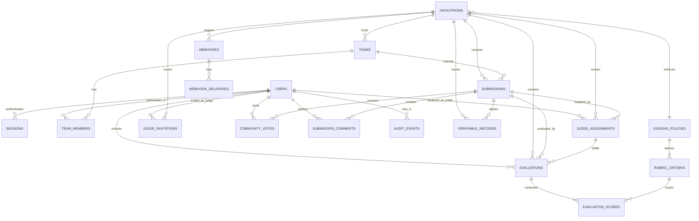

# Data Model & Schema Specification

## 1. Overview

The DOGFOOD platform uses PostgreSQL 16 as its relational persistence layer. All persistence operations use parameterized SQL directly through connection pools (`pg` library), deliberately avoiding an Object-Relational Mapper (ORM). This guarantees transparent execution plans, explicit transaction boundaries, and database-enforced integrity.

Database evolution is managed via a transactional, forward-only migration runner (`backend/src/services/migration.service.ts`). Migrations `001` through `016` execute sequentially inside database transactions during application boot.

---

## 2. Entity Relationship Overview



---

## 3. Detailed Entity Definitions

### Core Users & Sessions (`001_create_users_and_sessions.sql`)
- **`users`**: Stores user credentials and role flag.
  - `id`: UUID PRIMARY KEY DEFAULT gen_random_uuid().
  - `email`: VARCHAR(255) UNIQUE NOT NULL.
  - `password_hash`: VARCHAR(255) NOT NULL (Argon2id hash).
  - `display_name`: VARCHAR(255) NOT NULL.
  - `is_admin`: BOOLEAN DEFAULT FALSE (True for Organizers).
  - `created_at`: TIMESTAMP WITH TIME ZONE DEFAULT NOW().
- **`sessions`**: Active authentication tokens.
  - `id`: UUID PRIMARY KEY DEFAULT gen_random_uuid().
  - `user_id`: UUID REFERENCES users(id) ON DELETE CASCADE.
  - `token`: VARCHAR(255) UNIQUE NOT NULL (32-byte crypto-random hex).
  - `expires_at`: TIMESTAMP WITH TIME ZONE NOT NULL.

### Rubrics & Judging Policies (`002_create_judging_policies.sql`, `004_link_hackathon_policy.sql`)
- **`judging_policies`**: Collection of scoring criteria.
  - `id`: UUID PRIMARY KEY DEFAULT gen_random_uuid().
  - `name`: VARCHAR(255) NOT NULL.
  - `status`: VARCHAR(50) DEFAULT 'DRAFT' ('DRAFT' or 'PUBLISHED').
- **`rubric_criteria`**: Individual scoring dimension.
  - `id`: UUID PRIMARY KEY DEFAULT gen_random_uuid().
  - `policy_id`: UUID REFERENCES judging_policies(id) ON DELETE CASCADE.
  - `name`: VARCHAR(255) NOT NULL.
  - `min_score`: INT NOT NULL DEFAULT 1.
  - `max_score`: INT NOT NULL DEFAULT 10.
  - `weight`: INT NOT NULL (Percentage weight, total policy sum must equal 100).

### Hackathons, Teams, and Submissions (`003_create_judging_domain.sql`, `009_hackathon_submissions_close.sql`)
- **`hackathons`**: Core event entity.
  - `id`: UUID PRIMARY KEY DEFAULT gen_random_uuid().
  - `name`: VARCHAR(255) NOT NULL.
  - `description`: TEXT.
  - `status`: VARCHAR(50) DEFAULT 'DRAFT' ('DRAFT', 'ACTIVE', 'COMPLETED').
  - `policy_id`: UUID REFERENCES judging_policies(id).
  - `created_by`: UUID REFERENCES users(id).
  - `submissions_close`: TIMESTAMP WITH TIME ZONE.
  - `created_at`: TIMESTAMP WITH TIME ZONE DEFAULT NOW().
- **`teams`**: Participant groups.
  - `id`: UUID PRIMARY KEY DEFAULT gen_random_uuid().
  - `hackathon_id`: UUID REFERENCES hackathons(id) ON DELETE CASCADE.
  - `name`: VARCHAR(255) NOT NULL.
- **`team_members`**: Join table mapping Users to Teams.
  - `team_id`: UUID REFERENCES teams(id) ON DELETE CASCADE.
  - `user_id`: UUID REFERENCES users(id) ON DELETE CASCADE.
  - PRIMARY KEY (`team_id`, `user_id`).
- **`submissions`**: Project entries.
  - `id`: UUID PRIMARY KEY DEFAULT gen_random_uuid().
  - `hackathon_id`: UUID REFERENCES hackathons(id) ON DELETE CASCADE.
  - `team_id`: UUID REFERENCES teams(id) ON DELETE CASCADE.
  - `title`: VARCHAR(255) NOT NULL.
  - `description`: TEXT.
  - `repository_url`: VARCHAR(512).

### Judging & Score Storage (`003_create_judging_domain.sql`, `005_create_evaluations.sql`, `012_create_judge_invitations.sql`)
- **`judge_invitations`**: Pending judge invites.
  - `id`: UUID PRIMARY KEY DEFAULT gen_random_uuid().
  - `hackathon_id`: UUID REFERENCES hackathons(id) ON DELETE CASCADE.
  - `user_id`: UUID REFERENCES users(id) ON DELETE CASCADE.
  - `status`: VARCHAR(50) DEFAULT 'PENDING' ('PENDING', 'ACCEPTED', 'DECLINED').
- **`judge_assignments`**: Assignment mapping Judge to Submission.
  - `id`: UUID PRIMARY KEY DEFAULT gen_random_uuid().
  - `hackathon_id`: UUID REFERENCES hackathons(id) ON DELETE CASCADE.
  - `submission_id`: UUID REFERENCES submissions(id) ON DELETE CASCADE.
  - `judge_user_id`: UUID REFERENCES users(id) ON DELETE CASCADE.
  - UNIQUE (`submission_id`, `judge_user_id`).
- **`evaluations`**: Evaluation container.
  - `id`: UUID PRIMARY KEY DEFAULT gen_random_uuid().
  - `assignment_id`: UUID REFERENCES judge_assignments(id) ON DELETE CASCADE.
  - `hackathon_id`: UUID REFERENCES hackathons(id) ON DELETE CASCADE.
  - `submission_id`: UUID REFERENCES submissions(id) ON DELETE CASCADE.
  - `judge_user_id`: UUID REFERENCES users(id) ON DELETE CASCADE.
  - `status`: VARCHAR(50) DEFAULT 'DRAFT' ('DRAFT' or 'SUBMITTED').
  - `total_score`: NUMERIC(10,4).
- **`evaluation_scores`**: Itemized criterion score breakdown.
  - `id`: UUID PRIMARY KEY DEFAULT gen_random_uuid().
  - `evaluation_id`: UUID REFERENCES evaluations(id) ON DELETE CASCADE.
  - `criterion_id`: UUID REFERENCES rubric_criteria(id).
  - `raw_score`: NUMERIC(10,4) NOT NULL.
  - `normalized_score`: NUMERIC(10,4) NOT NULL.
  - `weighted_score`: NUMERIC(10,4) NOT NULL.

### Audit Trail (`006_create_audit_events.sql`, `007_secure_audit_log.sql`)
- **`audit_events`**: Immutable event log.
  - `id`: UUID PRIMARY KEY DEFAULT gen_random_uuid().
  - `hackathon_id`: UUID REFERENCES hackathons(id) ON DELETE SET NULL.
  - `actor_user_id`: UUID REFERENCES users(id) ON DELETE SET NULL.
  - `action_type`: VARCHAR(100) NOT NULL.
  - `payload`: JSONB NOT NULL.
  - `created_at`: TIMESTAMP WITH TIME ZONE DEFAULT NOW().

### Community Engagement (T3) (`013_create_community_votes.sql`, `014_create_submission_comments.sql`)
- **`community_votes`**: Participant votes.
  - `id`: UUID PRIMARY KEY DEFAULT gen_random_uuid().
  - `submission_id`: UUID REFERENCES submissions(id) ON DELETE CASCADE.
  - `user_id`: UUID REFERENCES users(id) ON DELETE CASCADE.
  - UNIQUE (`submission_id`, `user_id`).
- **`submission_comments`**: Discussion comments.
  - `id`: UUID PRIMARY KEY DEFAULT gen_random_uuid().
  - `submission_id`: UUID REFERENCES submissions(id) ON DELETE CASCADE.
  - `user_id`: UUID REFERENCES users(id) ON DELETE CASCADE.
  - `content`: TEXT NOT NULL.

### Verifiable Records & Webhooks (T4) (`015_create_verifiable_records.sql`, `016_create_webhooks.sql`)
- **`verifiable_records`**: Cryptographic certificates.
  - `id`: UUID PRIMARY KEY DEFAULT gen_random_uuid().
  - `type`: VARCHAR(50) NOT NULL ('PARTICIPANT_CERTIFICATE' or 'JUDGE_PARTICIPATION').
  - `target_user_id`: UUID REFERENCES users(id) ON DELETE SET NULL.
  - `hackathon_id`: UUID REFERENCES hackathons(id) ON DELETE CASCADE.
  - `submission_id`: UUID REFERENCES submissions(id) ON DELETE SET NULL.
  - `idempotency_key`: TEXT UNIQUE.
  - `payload`: JSONB NOT NULL.
  - `signature`: TEXT NOT NULL (Ed25519 signature in base64).
  - `kid`: VARCHAR(100) NOT NULL.
  - `issued_at`: TIMESTAMP WITH TIME ZONE DEFAULT NOW().
- **`server_signing_keys`**: Ed25519 signing keys.
  - `id`: UUID PRIMARY KEY DEFAULT gen_random_uuid().
  - `kid`: VARCHAR(100) UNIQUE NOT NULL.
  - `public_key`: TEXT NOT NULL.
  - `private_key_enc`: TEXT NOT NULL.
  - `created_at`: TIMESTAMP WITH TIME ZONE DEFAULT NOW().
  - `retired_at`: TIMESTAMP WITH TIME ZONE.
- **`webhooks`**: Registered webhook receivers.
  - `id`: UUID PRIMARY KEY DEFAULT gen_random_uuid().
  - `hackathon_id`: UUID REFERENCES hackathons(id) ON DELETE CASCADE.
  - `url`: VARCHAR(2000) NOT NULL.
  - `secret`: VARCHAR(255) NOT NULL.
  - `is_active`: BOOLEAN DEFAULT true.
  - `created_at`: TIMESTAMP WITH TIME ZONE DEFAULT NOW().
  - `updated_at`: TIMESTAMP WITH TIME ZONE DEFAULT NOW().
- **`webhook_deliveries`**: Webhook delivery outbox log.
  - `id`: UUID PRIMARY KEY DEFAULT gen_random_uuid().
  - `webhook_id`: UUID REFERENCES webhooks(id) ON DELETE CASCADE.
  - `event_type`: VARCHAR(255) NOT NULL.
  - `payload`: JSONB NOT NULL.
  - `status`: VARCHAR(50) DEFAULT 'PENDING' ('PENDING', 'SUCCESS', 'FAILED').
  - `attempt_count`: INT DEFAULT 0.
  - `next_retry_at`: TIMESTAMP WITH TIME ZONE DEFAULT NOW().
  - `last_response_status`: INT.
  - `last_response_body`: TEXT.
  - `created_at`: TIMESTAMP WITH TIME ZONE DEFAULT NOW().
  - `updated_at`: TIMESTAMP WITH TIME ZONE DEFAULT NOW().

---

## 4. Integrity Constraints & Security Rules

1. **Uniqueness Constraints**:
   - `users(email)`: Prevents duplicate user registrations.
   - `sessions(token)`: Guarantees session token entropy.
   - `judge_assignments(submission_id, judge_user_id)`: Prevents assigning a judge twice to the same submission.
   - `community_votes(submission_id, user_id)`: Prevents double-voting by the same user on a project.
   - `verifiable_records(idempotency_key)`: Guarantees idempotent record generation.
2. **Foreign Key Cascades**:
   - `ON DELETE CASCADE` on `team_members`, `submissions`, `evaluations`, `evaluation_scores`, `community_votes`, `submission_comments`, and `webhook_deliveries` ensures clean relational purging when parent entities are deleted.
3. **Database-Level Audit Immutability**:
   - PostgreSQL trigger `trg_prevent_audit_update` on `audit_events` executes function `prevent_audit_modification()`, throwing a database `RAISE EXCEPTION` if any SQL `UPDATE` or `DELETE` is executed against the table.

---

## 5. Example Data Lifecycle

```text
User Account Created (users table)
        ↓
User joins Team (team_members table)
        ↓
Team creates Submission (submissions table)
        ↓
Organizer assigns Judge (judge_assignments table)
        ↓
Judge creates Evaluation (evaluations table with status='DRAFT')
        ↓
Scores added per Rubric Criterion (evaluation_scores table)
        ↓
Judge submits Evaluation (evaluations status updated to 'SUBMITTED', total_score computed)
        ↓
Audit Event recorded (audit_events table inserted inside same transaction)
        ↓
Organizer Finalizes Event & Issues Record (verifiable_records table inserted with Ed25519 signature)
```
