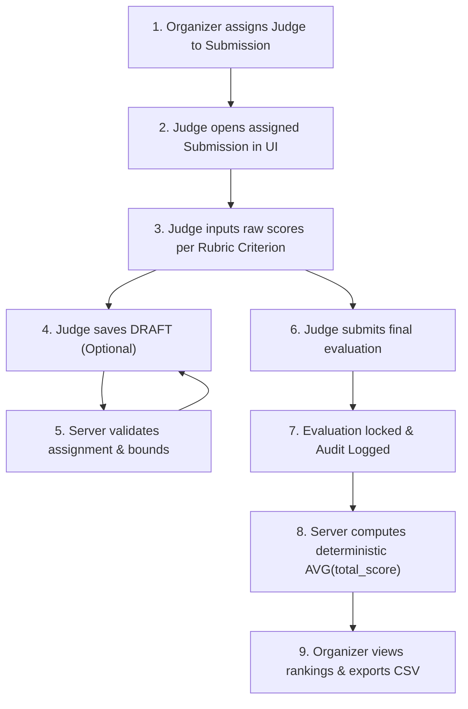

# Judging & Scoring Integrity Model

## Overview
DOGFOOD 2026 implements a deterministic human scoring engine. This document answers skeptical technical questions regarding scoring fairness, assignment isolation, score locks, draft handling, missing evaluation treatment, and mathematical aggregation.

---

## Judging Lifecycle Flowchart

---

## 1. Judge Assignment Scoping

### Question
How are judges assigned, and can a judge score unassigned submissions?

### Technical Explanation
Judges can only score project submissions to which they have been explicitly assigned by an Organizer. The server enforces assignment scoping at both the route controller and database query level. Unassigned judges cannot access scoring forms or post score payloads.

- **Implementation**: `backend/src/routes/judging.ts`, `backend/src/services/scoring.service.ts` (`saveEvaluation`)
- **API Endpoints**: `GET /api/judging/assignments`, `PUT /api/judging/submissions/:id/evaluation`
- **Database Tables**: `judge_assignments`, `evaluations`
- **Test Evidence**: `backend/tests/scoring.test.ts` (`should reject score if judge not assigned`)
- **Manual Demonstration**: Login as `judge_a@dogfood.local` → Attempt to query or score an unassigned submission ID via API → Server returns `403 Forbidden` (`"You are not assigned to this submission"`).

---

## 2. Judge Peer Isolation

### Question
Can judges access scores submitted by peer judges evaluating the same submission?

### Technical Explanation
Judges are strictly isolated from peer scores to eliminate "herd mentality" and peer-pressure bias. When a judge fetches their evaluation dashboard or project scoring context, the SQL query explicitly enforces `WHERE judge_user_id = $auth_user_id`.

- **Implementation**: `backend/src/services/judging.service.ts` (`getEvaluationContext`)
- **API Endpoints**: `GET /api/judging/submissions/:id/evaluation`
- **Database Tables**: `evaluations`, `judge_assignments`
- **Test Evidence**: `backend/tests/audit_integrity.test.ts` (`should prevent judge from accessing another judge's evaluation context`)
- **Manual Demonstration**: Login as `judge_a@dogfood.local` → Query `GET /api/judging/submissions/prj_07/evaluation` → Payload returns only Judge A's evaluation record; Judge B's scores are omitted.

---

## 3. Own-Team Evaluation Prevention

### Question
What prevents a judge from evaluating a project submitted by their own team?

### Technical Explanation
The assignment creation routine checks the `team_members` table. If the candidate judge's `user_id` matches any `user_id` on the team that created the target submission, the assignment is rejected. Furthermore, a DB constraint prevents self-evaluations.

- **Implementation**: `backend/src/services/judging.service.ts` (`assignJudge`)
- **API Endpoints**: `POST /api/hackathons/:id/assignments`
- **Database Tables**: `team_members`, `submissions`, `judge_assignments`
- **Test Evidence**: `backend/tests/domain.test.ts` (`should reject assignment if judge belongs to submission team`)
- **Manual Demonstration**: Attempt to assign `participant@dogfood.local` (who belongs to `tm_01`) to score `prj_01` → Server returns `400 Bad Request` (`"Judge cannot be assigned to their own team"`).

---

## 4. Draft Evaluations

### Question
How are draft scores handled, and do they affect the public leaderboard or final results?

### Technical Explanation
Judges can save incomplete evaluations as `DRAFT` status (`status = 'DRAFT'`). Draft evaluations are strictly excluded from score aggregation queries, rankings, and CSV exports (`WHERE status = 'SUBMITTED'`). Drafts allow judges to refine scores over time without prematurely altering standings.

- **Implementation**: `backend/src/services/scoring.service.ts` (`getHackathonResults`)
- **API Endpoints**: `PUT /api/judging/submissions/:id/evaluation` (with `submit: false`)
- **Database Tables**: `evaluations`
- **Test Evidence**: `backend/tests/aggregation.test.ts` (`DRAFT evaluations excluded, missing evals not treated as zero`)
- **Manual Demonstration**: Save a score as `DRAFT` as Judge A → View Organizer Results dashboard → Standings remain unchanged; project shows 0 submitted evaluations.

---

## 5. Submitted Evaluation Lock & Immutability

### Question
Can a judge edit their scores after marking an evaluation as SUBMITTED?

### Technical Explanation
Once an evaluation transitions to `SUBMITTED`, it is permanently locked. Any subsequent `PUT` request targeting that evaluation is rejected by `scoring.service.ts` with a `409 Conflict` error (`"Evaluation has already been submitted and cannot be changed."`). The React UI simultaneously converts the form to a read-only state.

- **Implementation**: `backend/src/services/scoring.service.ts` (`saveEvaluation` FOR UPDATE lock)
- **API Endpoints**: `PUT /api/judging/submissions/:id/evaluation`
- **Database Tables**: `evaluations`
- **Test Evidence**: `backend/tests/scoring.test.ts` (`should reject updates to a SUBMITTED evaluation`)
- **Manual Demonstration**: Submit an evaluation as Judge A → Attempt to send another `PUT` request with altered scores → Server returns `409 Conflict` (`"Evaluation has already been submitted and cannot be changed."`).

---

## 6. Treatment of Missing & Unsubmitted Evaluations

### Question
If a judge fails to submit their evaluation, is the project penalized with a zero score?

### Technical Explanation
No. Missing or unsubmitted judge evaluations are completely omitted from the SQL arithmetic mean calculation (`AVG(total_score)`). A project evaluated by 2 out of 3 assigned judges receives an aggregate score calculated as `(Score_1 + Score_2) / 2`. Unsubmitted evaluations do not inflict a 0 penalization.

- **Implementation**: `backend/src/services/scoring.service.ts`
- **API Endpoints**: `GET /api/hackathons/:id/results`
- **Database Tables**: `evaluations`
- **Test Evidence**: `backend/tests/aggregation.test.ts` (`missing evals not treated as zero`)
- **Manual Demonstration**: Assign 3 judges to project P → Have Judge 1 submit 80, Judge 2 submit 90, Judge 3 remain unsubmitted → Aggregate result displays exactly 85.0000.

---

## 7. Score Normalization & Weighted Aggregation

### Question
How are rubric criteria with different min/max bounds combined deterministically?

### Technical Explanation
Each raw criterion score is mapped to a normalized ratio `[0.0, 1.0]` using `normalized_score = (raw_score - min_score) / (max_score - min_score)`. The normalized score is multiplied by `criterion_weight`. The sum of weighted scores forms the `total_score`. The submission score is the arithmetic mean of all `SUBMITTED` evaluation totals.

- **Implementation**: `backend/src/services/scoring.service.ts` (`saveEvaluation`)
- **API Endpoints**: `PUT /api/judging/submissions/:id/evaluation`
- **Database Tables**: `rubric_criteria`, `evaluation_scores`, `evaluations`
- **Test Evidence**: `backend/tests/scoring.test.ts`, `backend/tests/aggregation.test.ts`
- **Manual Demonstration**: Input raw score 4/5 for a 40% weight criterion → Normalized ratio = 0.75 → Weighted contribution = 30.0000.

---

## 8. Organizer Results Access & CSV Export

### Question
Who can view overall hackathon rankings and download the results CSV?

### Technical Explanation
Only authenticated Organizers (`users.is_admin = true`) can access the unredacted hackathon results dashboard and download the CSV export. Public participants cannot view full standings until after `submissions_close`.

- **Implementation**: `backend/src/routes/hackathons.ts`, `backend/src/services/migration.service.ts`
- **API Endpoints**: `GET /api/hackathons/:id/results`, `GET /api/hackathons/:id/export.csv`
- **Database Tables**: `hackathons`, `submissions`, `evaluations`
- **Test Evidence**: `backend/tests/bulk_import.test.ts`, `python run.py .dogfood.toml` (T2 CSV export check)
- **Manual Demonstration**: Login as `organizer@dogfood.local` → Navigate to Results → Click "Export CSV" → Browser downloads `export.csv` formatted with Rank, Team, Submission, and Final Score.
