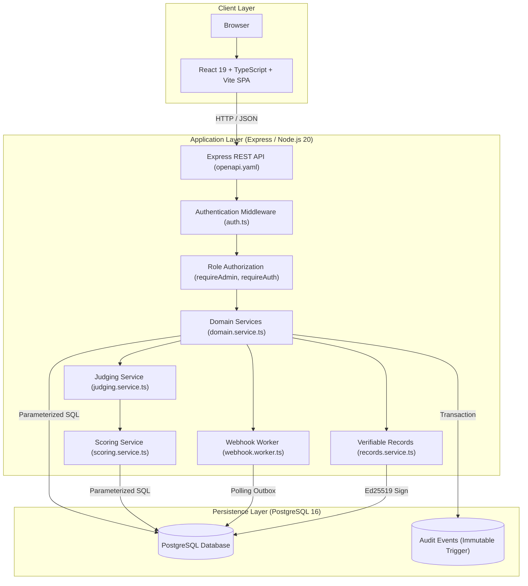

# DOGFOOD 2026

A self-hosted, offline-capable hackathon submission, judging, and verification platform engineered for server-side authorization, deterministic score normalization, relational auditability, and cryptographic record verification.

---

## 1. One-Minute Overview

### What the Platform Is
DOGFOOD 2026 is an API-first hackathon submission, judging, and verification portal. It serves three primary user personas: **Organizers** who configure hackathons and rubrics, **Judges** who evaluate project submissions, and **Participants** who register teams, submit projects, and engage in community voting.

### What Problem It Solves
Hackathon evaluation platforms often suffer from security and integrity flaws:
- Client-side scoring math that can be manipulated in browser developer tools.
- Vulnerabilities where judges can view peer scores and succumb to herd bias.
- Unconstrained database access where draft or missing scores unfairly penalize teams with zero values.
- Lack of cryptographic verification for issued winning certificates.

DOGFOOD 2026 resolves these issues by enforcing **strict server-side authority**, parameterized direct database queries, deterministic min-max score normalization, immutable audit logs protected by PostgreSQL triggers, and native Ed25519 cryptographic signing for public verification.

---

## 2. What Is Actually Implemented

The repository implements capabilities across four functional tiers:

### T1 — Core Hackathon Platform
- **Authentication & Sessions**: Password hashing using Argon2id with salt, high-entropy token-based sessions stored in `sessions` table (`backend/src/services/auth.service.ts`).
- **Role Isolation**: Strict separation between Organizers (`is_admin = true`), Judges (scoped by `judge_assignments`), Participants, and public visitors.
- **Event Lifecycle**: Configurable dates and state machine (`DRAFT` → `ACTIVE` → `COMPLETED`) with server-enforced deadline checks (`submissions_close`).
- **Teams & Submissions**: Participant team creation (`teams`, `team_members`) and project submission management (`submissions`).
- **Public Gallery**: Unauthenticated project gallery route (`GET /api/public/gallery`).

### T2 — Deterministic Judging Engine
- **Judge Invitation & Assignment**: Organizers invite and explicitly assign judges to submissions (`judge_assignments`, `judge_invitations`).
- **Weighted Rubrics**: Configurable rubric criteria with independent `min_score` and `max_score` bounds and integer percentage weights (`judging_policies`, `rubric_criteria`).
- **Judge Isolation & Self-Evaluation Blocking**: Judges only see assigned projects (`GET /api/judging/assignments`), cannot see peer scores, and cannot evaluate their own team.
- **Server-Side Score Normalization**: Raw integer scores are mapped to a `[0.0, 1.0]` ratio and scaled by percentage weight server-side (`backend/src/services/scoring.service.ts`).
- **Organizer CSV Export**: Aggregated standings CSV export (`GET /api/hackathons/:id/export.csv`).

### T3 — Community Engagement & Auditability
- **Community Voting**: Authenticated participants cast exactly 1 vote per project (`community_votes`), enforced by DB constraints (`UNIQUE(submission_id, user_id)`).
- **Public Comments**: Authenticated discussion threads per submission (`submission_comments`).
- **Results Embargo & Randomized Gallery**: Deterministic random seed ballot sorting (`GET /api/public/gallery?seed=X`), with standings embargoed until the event closes.
- **Trigger-Protected Audit Log**: Relational event logging (`audit_events`) with PostgreSQL trigger `trg_prevent_audit_update` executing `prevent_audit_modification()` to block SQL `UPDATE` and `DELETE` queries.

### T4 — Advanced Integrations & Transparency
- **REST API + OpenAPI 3.0.3**: Complete REST endpoints for UI actions documented in `openapi.yaml`.
- **Transactional Outbox Webhooks**: Event-driven webhooks (`webhooks`, `webhook_deliveries`) signed with HMAC-SHA256 headers (`X-Dogfood-Signature`) and exponential backoff retry worker (`backend/src/workers/webhook.worker.ts`, max 5 attempts with `5^attempt_count` second backoff).
- **Signed Cryptographic Records**: Ed25519-signed record generation (`verifiable_records`) for completed events (`POST /api/hackathons/:id/verifiable-records/issue`).
- **Public Verification Endpoints**: Public record retrieval (`GET /api/public/records/:recordId`) and key discovery (`GET /api/public/keys`) for native Ed25519 cryptographic signature verification (`crypto.verify`).
- **Atomic Bulk Import/Export**: Portable JSON event packages (`GET /api/hackathons/:id/export`, `POST /api/hackathons/import`) with transactional rollback and UUID remapping.
- **Embeddable Gallery**: Dedicated route (`/embed/gallery`) with route-specific Content Security Policy modification (`frame-ancestors *` and suppressed `X-Frame-Options`).

---

## 3. Architecture Overview



### Architecture Explanation
1. **Client Layer**: Single-Page Application (SPA) built with React 19, Vite, and Tailwind CSS. Acts strictly as an HTTP client with zero database connection or score calculation responsibility.
2. **Application Layer**: Express REST API running on Node.js 20. Handles routing, request schema validation (Zod), Argon2id credential checks, role isolation, min-max score normalization, Ed25519 signing, and webhook outbox polling.
3. **Persistence Layer**: PostgreSQL 16 database executing parameterized SQL via `pg` connection pool. Schema constraints enforce uniqueness, foreign-key cascades, state checks, and audit immutability triggers.

---

## 4. Request Lifecycle

The detailed path of a scoring request:

```text
Judge Clicks "Submit Evaluation" in React UI
        ↓
React sends PUT /api/judging/submissions/:id/evaluation with raw criterion scores
        ↓
Express receives HTTP request and routes to judging controller (judging.ts)
        ↓
auth.ts middleware extracts Bearer token from header & queries sessions table
        ↓
judging.ts controller checks judge assignment: verifies (submission_id, judge_user_id) in DB
        ↓
scoring.service.ts validates rubric bounds: raw_score >= min_score AND raw_score <= max_score
        ↓
scoring.service.ts computes normalized_score = (raw - min)/(max - min) & weighted_score
        ↓
DB transaction opens: inserts/updates evaluations & evaluation_scores table
        ↓
Audit logger writes event to audit_events within the exact same DB transaction
        ↓
DB transaction commits atomically
        ↓
API responds with 200 OK + evaluation JSON payload
        ↓
React UI updates status badge to "SUBMITTED" and locks form input
```

---

## 5. Implementation Map

| Capability | Frontend File | Backend Route / Service | Database Schema | Automated Test |
| --- | --- | --- | --- | --- |
| **Authentication** | `src/pages/Login.tsx`, `src/contexts/AuthContext.tsx` | `routes/auth.ts`, `services/auth.service.ts` | `users`, `sessions` | `tests/auth.test.ts` |
| **Participant Submissions** | `src/pages/ParticipantSubmissions.tsx` | `routes/public.ts`, `services/domain.service.ts` | `submissions`, `teams` | `tests/public.test.ts` |
| **Judge Scoring** | `src/pages/JudgingSubmission.tsx` | `routes/judging.ts`, `services/scoring.service.ts` | `evaluations`, `evaluation_scores` | `tests/scoring.test.ts` |
| **Score Normalization** | N/A (Server-Only) | `services/scoring.service.ts` | `rubric_criteria`, `evaluation_scores` | `tests/aggregation.test.ts` |
| **Community Voting** | `src/pages/PublicSubmissionDetail.tsx` | `routes/public.ts`, `services/domain.service.ts` | `community_votes` | `tests/public.test.ts` |
| **Audit Logging** | `src/pages/AuditLog.tsx` | `routes/audit.ts`, `services/audit.service.ts` | `audit_events` | `tests/audit_integrity.test.ts` |
| **Webhooks Outbox** | `src/components/WebhookSettings.tsx` | `routes/webhooks.ts`, `workers/webhook.worker.ts` | `webhooks`, `webhook_deliveries` | `tests/webhooks.test.ts` |
| **Verifiable Records** | `src/pages/RecordView.tsx`, `src/pages/KeysView.tsx` | `routes/hackathons.ts`, `services/records.service.ts` | `verifiable_records` | `tests/verifiable_records.test.ts` |
| **Bulk Import / Export** | `src/pages/Settings.tsx` | `routes/hackathons.ts`, `services/migration.service.ts` | Full relational schema | `tests/bulk_import.test.ts` |

---

## 6. Easy Setup Guide / Quick Start

### Prerequisites
- Docker Engine 20.10+ and Docker Compose v2.0+ installed locally.
- Node.js 20+ and Python 3.10+ (if running tests/acceptance verifier directly outside Docker).

### Step 1 — Clone & Navigate
```bash
git clone <repository-url>
cd dogfood
```

### Step 2 — Launch System with Docker Compose
```bash
docker compose up -d --build
```
*This starts `dogfood-db` (PostgreSQL 16 on port 5432) and a unified backend container serving both the Node/Express API and the compiled static Vite frontend on port 3000.*

### Step 3 — Verify Running Services
- **Web UI**: Open [http://localhost:3000](http://localhost:3000)
- **API Health Check**: `curl http://localhost:3000/api/health`
- **OpenAPI Spec**: Inspect `openapi.yaml` in the repository root.

### Step 4 — Login with Seeded Demo Accounts
The database automatically seeds `Sample Hack 2026` with four canonical demo accounts from `fixtures.json`. All accounts authenticate with password **`dogfood2026`**:

| Role | Email | Password | Allowed Capabilities |
| --- | --- | --- | --- |
| **Organizer** | `organizer@dogfood.local` | `dogfood2026` | Create hackathons, manage policies, assign judges, export CSV, issue records, manage webhooks |
| **Judge A** | `judge_a@dogfood.local` | `dogfood2026` | View assigned projects, submit scores for assigned projects |
| **Judge B** | `judge_b@dogfood.local` | `dogfood2026` | View assigned projects, submit scores for assigned projects |
| **Participant** | `participant@dogfood.local` | `dogfood2026` | Submit team project, vote on projects, leave public comments |

### Step 5 — Test the Main Flow Walkthrough
1. **Login as Organizer** (`organizer@dogfood.local` / `dogfood2026`).
2. Navigate to **Dashboard** → Inspect `Sample Hack 2026`.
3. View **Judging Policies** → Confirm the active published rubric (100% total weight).
4. Navigate to **Teams / Submissions** → Inspect project entries (e.g., `prj_07`).
5. Check **Judge Assignments** → Verify `judge_a` is assigned to `prj_07`.
6. **Logout**, then **Login as Judge A** (`judge_a@dogfood.local` / `dogfood2026`).
7. Open **Judging Dashboard** → Select assigned project `prj_07`.
8. Input raw scores (e.g. 4/5 for criteria) → Click **Save Draft** → Observe state `DRAFT`.
9. Click **Submit Evaluation** → Status transitions to `SUBMITTED` and input locks.
10. **Logout**, then **Login as Organizer** (`organizer@dogfood.local` / `dogfood2026`).
11. Navigate to **Results** → View aggregated score calculation.
12. Click **Export CSV** → Download `export.csv` containing full standings.

---

## 7. Clean Install & Offline Operation Guide

### How `docker compose up --build` Works
1. Starts `dogfood-db` container running PostgreSQL 16.
2. Applies database migrations `001` through `016` sequentially inside transactions.
3. Executes `seedFixtures()` from `backend/src/seed-fixtures.ts`, loading `fixtures.json` (30 judges, 40 teams, 41 submissions, 126 evaluations).
4. Starts the unified backend container on port 3000 serving both API routes and compiled static frontend assets.

### Offline Readiness Requirements
After Docker images (`node:20-alpine`, `postgres:16-alpine`) and build dependencies have been obtained, the DOGFOOD platform operates offline for core application functionality, migrations, seeding, judging, and acceptance testing. The frontend may request Google Fonts when internet access is available; without internet access, it falls back to system fonts and core functionality remains operational.
- **Local Webhook Execution**: Webhooks dispatch to local/internal network endpoints.
- **Local Cryptography**: Ed25519 keypairs are generated and verified entirely in-memory using Node.js `crypto` module.

---

## 8. Tier Implementation Evidence

### T1 — Core Hackathon Platform
- **Features**: Authentication, Sessions, Roles, Event Dates, Submissions, Gallery.
- **Implementation**: `backend/src/routes/auth.ts`, `backend/src/routes/public.ts`.
- **API Endpoints**: `POST /api/auth/login`, `POST /api/public/submit`, `GET /api/public/gallery`.
- **Database Tables**: `users`, `sessions`, `hackathons`, `teams`, `team_members`, `submissions`.
- **Automated Tests**: `backend/tests/auth.test.ts`, `backend/tests/public.test.ts`.
- **Verification**: Run `python run.py .dogfood.toml` → Checks T1 gallery public, fixture shown, closed event refusal.

### T2 — Deterministic Judging Engine
- **Features**: Judge invitations/assignments, Rubric bounds/weights, Judge isolation, Min-max score normalization, Organizer CSV export.
- **Implementation**: `backend/src/services/judging.service.ts`, `backend/src/services/scoring.service.ts`.
- **API Endpoints**: `PUT /api/judging/submissions/:id/evaluation`, `GET /api/hackathons/:id/export.csv`.
- **Database Tables**: `judging_policies`, `rubric_criteria`, `judge_assignments`, `evaluations`, `evaluation_scores`.
- **Automated Tests**: `backend/tests/scoring.test.ts`, `backend/tests/aggregation.test.ts`.
- **Verification**: Run `python run.py .dogfood.toml` → Checks T2 judge score isolation, participant blocking, CSV export.

### T3 — Community & Audit Integrity
- **Features**: 1-user-1-vote voting, Public comments, Deterministic random seed ballot sorting, Result embargo, Trigger-protected audit log.
- **Implementation**: `backend/src/services/domain.service.ts`, `backend/src/services/audit.service.ts`.
- **API Endpoints**: `POST /api/public/submissions/:id/vote`, `POST /api/public/submissions/:id/comments`, `GET /api/audit`.
- **Database Tables**: `community_votes`, `submission_comments`, `audit_events` (with `trg_prevent_audit_update`).
- **Automated Tests**: `backend/tests/public.test.ts`, `backend/tests/audit_integrity.test.ts`.
- **Verification**: Execute `npm test -- tests/public.test.ts` to verify voting uniqueness and result embargo 403s.

### T4 — Advanced Integrations & Transparency
- **Features**: REST API / OpenAPI contract, HMAC-SHA256 Webhook outbox worker, Signed Ed25519 Verifiable Records, Public verification, Embeddable gallery, Atomic bulk import/export.
- **Implementation**: `backend/src/services/records.service.ts`, `backend/src/workers/webhook.worker.ts`, `backend/src/services/migration.service.ts`.
- **API Endpoints**: `POST /api/hackathons/:id/webhooks`, `POST /api/hackathons/:id/verifiable-records/issue`, `GET /api/public/records/:recordId`, `GET /api/public/keys`, `GET /api/hackathons/:id/export`, `POST /api/hackathons/import`.
- **Database Tables**: `webhooks`, `webhook_deliveries`, `verifiable_records`.
- **Automated Tests**: `backend/tests/webhooks.test.ts`, `backend/tests/verifiable_records.test.ts`, `backend/tests/bulk_import.test.ts`.
- **Verification**: Execute `npm test` (all 143 tests pass across 15 suites) and `npx @redocly/cli lint openapi.yaml` (valid).

---

## 9. Bonus Section & Technical Evidence

| Bonus Challenge | Status | Implementation & Evidence |
| --- | --- | --- |
| **Normalization Proof** | Implemented | [`NORMALIZATION-PROOF.md`](NORMALIZATION-PROOF.md) — Min-max normalization formula `(raw - min)/(max - min)` and percentage weighting in `scoring.service.ts`. Evaluated in `tests/scoring.test.ts` and `tests/aggregation.test.ts`. |
| **Threat Model** | Implemented | [`THREAT-MODEL.md`](THREAT-MODEL.md) — 11 threat scenarios mapped to trust boundaries, Express middleware, and PostgreSQL triggers. Evaluated in `tests/security.test.ts` and `tests/audit_integrity.test.ts`. |
| **API First** | Implemented | [`API-FIRST.md`](API-FIRST.md) — REST API coverage for UI actions documented in `openapi.yaml`. Verified with `@redocly/cli` linting and backend route coverage. |
| **Pairwise Mode** | Not Implemented | Intentionally not claimed. The system exclusively uses deterministic rubric-based absolute scoring. |

---

## 10. Verification Commands & Repository Map

### Official Verification Commands
```bash
# 1. Run all 143 backend integration tests
cd backend && npm test

# 2. Build frontend production bundle
cd frontend && npm run build

# 3. Lint OpenAPI 3.0.3 specification
npx @redocly/cli lint openapi.yaml

# 4. Run official DOGFOOD acceptance verifier (7/7 PASS)
python run.py .dogfood.toml

# 5. Check git diff formatting
git diff --check
```

### Repository Structure
```text
.
├── backend/                  # Node.js 20 / TypeScript Express API
│   ├── migrations/           # Transactional SQL migrations (001_... to 016_...)
│   ├── src/
│   │   ├── middleware/       # auth.ts, error-handler.ts, validate.ts
│   │   ├── routes/           # auth, public, judging, hackathons, webhooks, policies, audit
│   │   ├── services/         # auth, domain, judging, scoring, records, migration, webhook
│   │   ├── workers/          # webhook.worker.ts (Outbox polling worker)
│   │   └── seed-fixtures.ts  # Fixture importer with stable UUID constants
│   └── tests/                # 15 Jest test suites (143 total integration tests)
├── frontend/                 # React 19 / TypeScript / Vite SPA
│   ├── src/
│   │   ├── components/       # UI components, layout, webhooks, auth guards
│   │   ├── contexts/         # AuthContext.tsx
│   │   ├── pages/            # Dashboard, Gallery, JudgingSubmission, HackathonResults, etc.
│   │   └── services/         # api.ts (Axios REST API client)
├── docker-compose.yml        # Docker orchestration for PostgreSQL, Backend, Frontend
├── openapi.yaml              # OpenAPI 3.0.3 specification
├── fixtures.json             # Static event seed data (30 judges, 40 teams, 41 submissions)
├── .dogfood.toml             # Official acceptance checker configuration
├── run.py                    # Official acceptance checker script
├── acceptance-report.txt     # Output log of official acceptance script
└── *.md                      # Technical documentation suite
```
