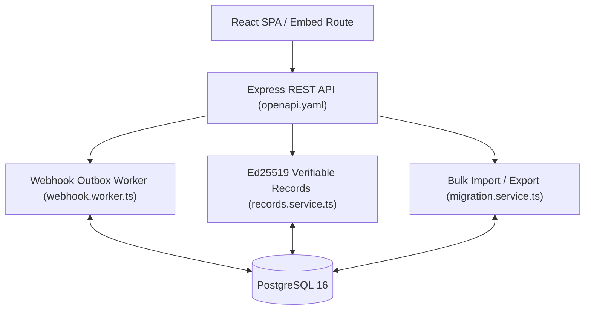

# T4 Implementation Evidence & Verification Report

> **Note on Terminology**: The categories below document internal T4 capability verification established within this project to evidence advanced integration and transparency goals. They represent project-level verification categories used to document the implementation, rather than additional official DOGFOOD T4 checker rules.

---

## T4 Architecture Diagram

---

## 1. REST API / OpenAPI Specification

1. **What DOGFOOD Requires**: An API-first architecture where platform actions can be driven programmatically via REST.
2. **What This Project Implements**: REST API capability backed by an OpenAPI 3.0.3 specification (`openapi.yaml`). The React UI acts strictly as an API client consumer.
3. **Architecture**: Express API controllers utilizing Zod middleware for schema validation (`backend/src/middleware/validate.ts`).
4. **Endpoint**: `openapi.yaml` and all `/api/*` routes.
5. **Database**: All persistence executed via direct parameterized SQL queries.
6. **Security / Control**: Session Bearer token authentication (`auth.ts`), role authorization (`requireAdmin`), and strict parameter validation.
7. **Automated Test**: Linted using `@redocly/cli lint openapi.yaml` (0 errors) and verified by 143 passing backend integration tests.
8. **Manual Demo Path**: Boot containers → Load `openapi.yaml` into SwaggerUI or Postman → Execute API endpoints directly.
9. **Known Limitation**: OpenAPI specification does not auto-generate frontend TypeScript type wrappers.

---

## 2. Transactional Outbox Webhooks

1. **What DOGFOOD Requires**: Event notification mechanism dispatches state changes to external endpoints with security signatures and retries.
2. **What This Project Implements**: Transactional outbox pattern using `webhooks` and `webhook_deliveries` tables. Outbox worker (`backend/src/workers/webhook.worker.ts`) polls pending deliveries where `next_retry_at <= NOW()`, signs headers (`X-Dogfood-Signature`), and retries failures up to 5 attempts with exponential backoff (`Math.pow(5, attempt_count)` seconds).
3. **Architecture**: Event mutations insert records into `webhook_deliveries` inside the domain transaction. A background worker polls every 5 seconds.
4. **Endpoint**: `POST /api/hackathons/:id/webhooks`, `GET /api/hackathons/:id/webhooks/:webhookId/deliveries`.
5. **Database**: `webhooks` (`url VARCHAR(2000)`), `webhook_deliveries` (`attempt_count`, `next_retry_at`, `last_response_status`, `last_response_body`).
6. **Security / Control**: `HMAC-SHA256(timestamp + "." + payload, secret)` signature header prevents delivery spoofing. URI checks prevent metadata SSRF.
7. **Automated Test**: `backend/tests/webhooks.test.ts` (11 unit and integration tests covering delivery creation, signature computation, and retries).
8. **Manual Demo Path**: Login as Organizer → Settings → Add Webhook URL → Trigger an evaluation submission → View delivery log status code in Webhook Settings UI.
9. **Known Limitation**: Polling outbox relies on internal database queries rather than an external distributed queue like RabbitMQ or Kafka.

---

## 3. Certificate & Verifiable Record Generation

1. **What DOGFOOD Requires**: Generating immutable result records for completed events.
2. **What This Project Implements**: Organizer endpoint constructs canonical JSON representations of final event standings (`PARTICIPANT_CERTIFICATE` and `JUDGE_PARTICIPATION`) when a hackathon transitions to `COMPLETED`.
3. **Architecture**: `records.service.ts` (`issueVerifiableRecords`) serializes scores, rankings, team details, and timestamps into standardized payloads.
4. **Endpoint**: `POST /api/hackathons/:id/verifiable-records/issue`.
5. **Database**: `verifiable_records` table (`id`, `type`, `target_user_id`, `hackathon_id`, `submission_id`, `idempotency_key`, `payload`, `signature`, `kid`, `issued_at`).
6. **Security / Control**: Restricted to Organizers (`requireAdmin`). Rejects issuance if hackathon status is `ACTIVE` or `DRAFT`.
7. **Automated Test**: `backend/tests/verifiable_records.test.ts` (`allows organizer to issue verifiable records idempotently`).
8. **Manual Demo Path**: Login as Organizer → Navigate to completed hackathon → Click "Generate Certificates" → Certificate records appear in database.
9. **Known Limitation**: Certificates are generated globally for the event rather than per individual student request.

---

## 4. Signed Public Records & Verification

1. **What DOGFOOD Requires**: Cryptographically signed public records that can be independently verified without trusting a database.
2. **What This Project Implements**: Generated record payloads are signed natively with an Ed25519 private key (`crypto.sign`). Public endpoints expose the Ed25519 public key and record payloads for native signature verification (`crypto.verify`).
3. **Architecture**: Node.js native `crypto` module generates Ed25519 keypairs and executes asymmetric signature generation and verification.
4. **Endpoint**: `GET /api/public/records/:recordId`, `GET /api/public/keys`.
5. **Database**: `verifiable_records`, `server_signing_keys` tables.
6. **Security / Control**: Publicly accessible. Verifies base64-encoded signature against canonical JSON payload.
7. **Automated Test**: `backend/tests/verifiable_records.test.ts` (`verifies cryptographic signature natively using public key`, `fails verification if payload is tampered`, `fails verification if signature is tampered`).
8. **Manual Demo Path**: Open Record View UI (`src/pages/RecordView.tsx`) or issue `curl http://localhost:8080/api/public/records/<record-id>` and `curl http://localhost:8080/api/public/keys`.
9. **Known Limitation**: Complete compromise of host server environment variables would expose the private signing key.

---

## 5. Embeddable Public Gallery Widget

1. **What DOGFOOD Requires**: Embeddable gallery widget suitable for iframe integration on third-party sites.
2. **What This Project Implements**: Dedicated frontend route `/embed/gallery` configured with route-specific security header handling (`Content-Security-Policy: frame-ancestors *` and suppressed `X-Frame-Options`).
3. **Architecture**: React route rendering a clean, borderless submission gallery tailored for `<iframe>` embedding.
4. **Endpoint**: `/embed/gallery` (Frontend SPA route).
5. **Database**: `submissions`, `hackathons` tables.
6. **Security / Control**: Suppresses frame restrictions strictly for `/embed/gallery`; all main application routes retain full clickjacking frame protection (`frame-ancestors 'none'`).
7. **Automated Test**: Frontend build verification and Express header middleware inspection (`app.ts`).
8. **Manual Demo Path**: Create a local HTML file `<iframe src="http://localhost:3000/embed/gallery" width="800" height="600"></iframe>` → Open in browser → Renders gallery seamlessly inside frame.
9. **Known Limitation**: The embedded view is read-only; voting or commenting requires navigating to the main domain.

---

## 6. Atomic Bulk Import & Export

1. **What DOGFOOD Requires**: Portable import/export capability for complete event states.
2. **What This Project Implements**: Serializes entire hackathons (teams, submissions, policies, rubrics, evaluations, scores) into a single portable JSON file. Imports execute inside a single PostgreSQL database transaction with email matching and UUID collision remapping.
3. **Architecture**: `migration.service.ts` constructs transactional SQL import queries and rolls back entirely if any constraint fails.
4. **Endpoint**: `GET /api/hackathons/:id/export`, `POST /api/hackathons/import`.
5. **Database**: Full relational schema (`hackathons`, `users`, `teams`, `submissions`, `evaluations`, `evaluation_scores`).
6. **Security / Control**: Restricted to Organizers (`requireAdmin`).
7. **Automated Test**: `backend/tests/bulk_import.test.ts` (`exports the complete event artifact safely`, `rejects import if structural failure occurs`, `successfully imports completed event`).
8. **Manual Demo Path**: Login as Organizer → Settings → Click "Export Event JSON" → Save file → Reset database → Click "Import Event JSON" → Event is restored atomically.
9. **Known Limitation**: User matching during import relies on email string equality.
