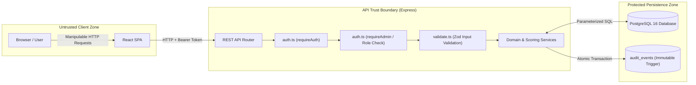

# Security Threat Model & Trust Boundaries

## 1. Security Overview

The DOGFOOD platform explicitly treats the client browser and React Single-Page Application as completely untrusted. All security policies, role isolation, scoring math, and audit immutability triggers are enforced within the Express REST API application boundary and PostgreSQL database engine.

---

## 2. Trust Boundary Diagram

---

## 3. Threat Assessment Matrix

| # | Threat | Attack Scenario | Impact | Mitigation | Implementation Location | Automated Test | Residual Risk |
| --- | --- | --- | --- | --- | --- | --- | --- |
| **1** | **Unauthorized Role Escalation** | A Participant sends HTTP requests to `/api/hackathons` trying to act as Organizer. | Unauthorized event creation / modification. | Express middleware `requireAdmin` verifies `req.user.is_admin === true`. | `backend/src/middleware/auth.ts` | `tests/auth.test.ts` | Development misconfiguration if new admin routes omit `requireAdmin`. |
| **2** | **Participant Accessing Judge Data** | A Participant attempts to read raw evaluation forms by guessing project UUIDs. | Leakage of sensitive judge feedback. | Controller checks judge assignment relation. Non-judges are rejected. | `backend/src/routes/judging.ts` | `tests/public.test.ts` | None; blocked at API layer. |
| **3** | **Judge Peer Score Access** | A Judge queries evaluations submitted by peer judges to align scores. | Herd mentality & scoring bias. | SQL query strictly appends `WHERE judge_user_id = $auth_user_id`. | `backend/src/services/judging.service.ts` | `tests/scoring.test.ts`, `tests/audit_integrity.test.ts` | None; masked at database layer. |
| **4** | **Judge Self-Evaluation** | A Judge attempts to score a project submitted by their own team. | Conflict of interest / score inflation. | Assignment service verifies judge `user_id` does NOT exist in `team_members` for the submission's team. | `backend/src/services/judging.service.ts` | `tests/domain.test.ts` | Organizer manually overriding DB relations directly. |
| **5** | **Deadline Bypass** | A Participant attempts to submit or edit a project after `submissions_close`. | Unfair advantage over other teams. | API queries `hackathons.submissions_close` timestamp and rejects late requests with `403 Forbidden`. | `backend/src/routes/public.ts` | `tests/public.test.ts` | Host server system clock drift. |
| **6** | **Post-Submit Score Modification** | A Judge attempts to update scores after marking an evaluation `SUBMITTED`. | Retroactive score tampering. | `scoring.service.ts` explicitly checks existing evaluation status; if `SUBMITTED`, rejects with `409 Conflict`. | `backend/src/services/scoring.service.ts` | `tests/scoring.test.ts` | Direct DB alteration by a malicious DBA. |
| **7** | **Duplicate Voting** | A Participant attempts to vote multiple times for their favorite team. | Skewed community voting results. | Database composite constraint `UNIQUE(submission_id, user_id)` on `community_votes` table. | PostgreSQL (`013_create_community_voting.sql`) | `tests/public.test.ts` | Sybil attack (registering multiple accounts). |
| **8** | **Webhook Delivery Forgery** | An attacker sends fake HTTP POST payloads to a receiver pretending to be DOGFOOD. | False integration triggers. | Webhook worker signs payloads using `HMAC-SHA256(timestamp + "." + payload, secret)` in `X-Dogfood-Signature` header. | `backend/src/workers/webhook.worker.ts` | `tests/webhooks.test.ts` | Receiver failing to verify signature. |
| **9** | **Malicious Import Injection** | An attacker uploads a crafted JSON import file containing invalid foreign keys or SQL snippets. | Database corruption or injection. | Import service executes inside a single DB transaction with parameterization and schema validation. | `backend/src/services/migration.service.ts` | `tests/bulk_import.test.ts` | Large payload memory exhaustion. |
| **10** | **Signed Record Tampering** | A user modifies a downloaded certificate JSON payload to claim 1st place instead of 5th. | Fraudulent certificate claims. | Verification math reconstitutes payload and verifies signature using Ed25519 public key via `crypto.verify`. | `backend/src/services/records.service.ts` | `tests/verifiable_records.test.ts` | Compromise of server `SIGNING_ENCRYPTION_KEY`. |
| **11** | **Audit Log Tampering** | An attacker attempts to execute `DELETE FROM audit_events` to cover tracks. | Destroys event auditability. | PostgreSQL trigger `trg_prevent_audit_update` executing `prevent_audit_modification()` throws `RAISE EXCEPTION` on `UPDATE` or `DELETE`. | PostgreSQL (`007_secure_audit_log.sql`) | `tests/audit_integrity.test.ts` | DBA dropping trigger via root SQL access. |

---

## 4. Residual Risks (Explicit Unmitigated Threats)

1. **Root Database Administrator Access**: Anyone with superuser access to the PostgreSQL server can execute `ALTER TABLE audit_events DISABLE TRIGGER ALL` or mutate records directly.
2. **Sybil Voting Attacks**: Because account registration is open, a user can register multiple accounts with disposable emails to cast extra community votes.
3. **Application Denial-of-Service**: While JSON payloads are limited to 100KB (`express.json({ limit: '100kb' })`), the application does not natively contain network-layer volumetric DDoS protection. Production deployments should utilize an upstream WAF / CDN (e.g. Cloudflare or Nginx rate limiting).
